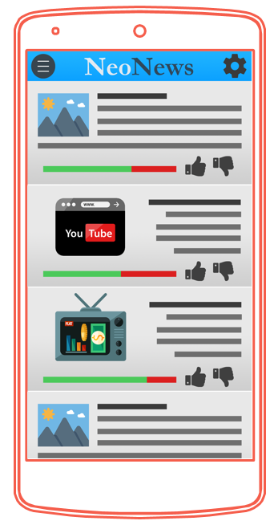
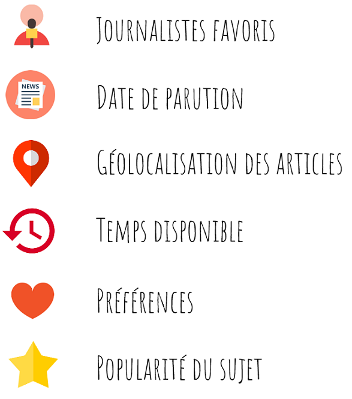
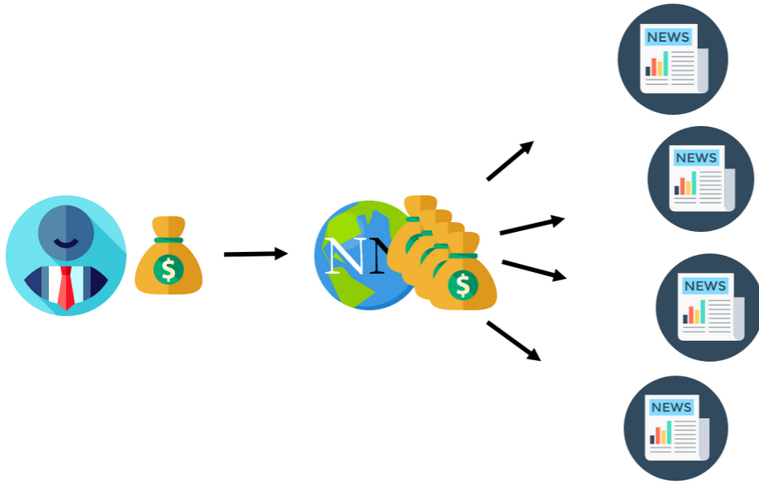

# NeoNewsPOC
POC de NeoNews, projet de fin d'étude sur 2 ans en équipe.

## NeoNews
NeoNews est une plateforme web et mobile d'agrégation d'informations (podcasts radio, vidéos, journaux...) centrées autour de l'utilisateur par le biais de filtres.  
Le tout s'affiche sous forme de fil d'actualité regroupé par sujets et trié par pertinence avec possibilité d'un abonnement centralisant les contenus payants.

## Les Points Clés
- Agrégateur de news multimédia
  - Articles de presse, podcasts, vidéos... Choisissez la source qui VOUS correspond !
- Abonnement unique
  - Consultez des articles complets tous journaux compris avec 1 seul abonnement !
- Filtres divers et variés
  - Géolocalisation d'articles, tri par journalistes favoris, par temps disponible... et bien d'autres encore !
- Centré sur l'utilisateur
  - Une application intuitive qui s'adapte à vos envies de recherche.  

## Pictures

## Equipe au moment du POC
[Charles des Pommare](https://github.com/Charles-des-Pommare)  
[Guillaume Bouxin](https://github.com/GuillaumeBouxin)  
[Antoine Caffier](https://github.com/impakte)  
[Yohan Vamour](https://github.com/YohanVM)  
[Vianney Doleans](https://github.com/VianneyDoleans) (n'est plus dans NeoNews)  
[Matthieu Delrive](https://github.com/matthieu-delrive) (n'est plus dans NeoNews)  
[Florian Vuillemot](https://github.com/florian-vuillemot) (n'est plus dans NeoNews)  
[Clément Nancelle](https://github.com/Hardkaise) (n'est plus dans NeoNews)  
